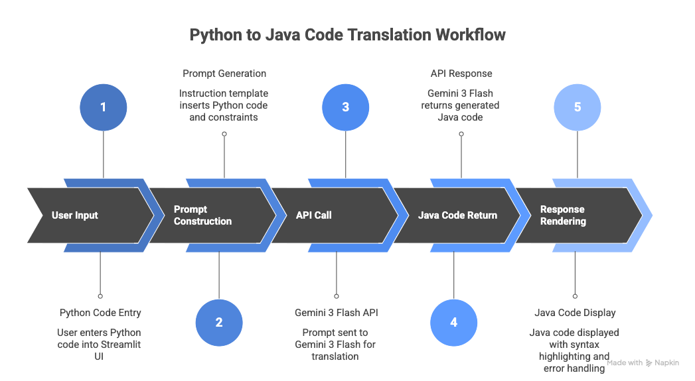

# Python → Java Translator – Milestone 2 (Proof of Concept)

This project implements a Proof-of-Concept (PoC) for Python-to-Java code translation using Gemini 3 Flash integrated via API and deployed using Streamlit on HuggingFace Spaces.

##  System Workflow

The overall workflow of the application is illustrated below:



The process follows these steps:

1. User inputs Python code in the Streamlit interface.
2. The system constructs a structured translation prompt.
3. The prompt is sent to Gemini 3 Flash via API.
4. The model generates equivalent Java code.
5. The translated Java code is displayed in the UI.

---

## Live Deployment

The application is publicly available at:
```
https://huggingface.co/spaces/Ait-Achour/PseudoCodeRAG-Translator
```

No installation is required to test the system.

---

## Run Locally

### 1. Clone the repository

```
git clone https://github.com/Ayman-AITACHOUR/PseudoCodeRAG-Translator.git  
cd PseudoCodeRAG-Translator/Milestone\ 2/code
```

---

### 2. Install dependencies

```
pip install -r requirements.txt
```

---

### 3. Configure API Key (Local Execution)

Create a `.env` file inside the `code` directory:

```
GEMINI_API_KEY=your_api_key_here
```

The application loads the API key from environment variables.

---

### 4. Run the application

```
streamlit run src/streamlit_app.py
```
Then open:
```
http://localhost:8501
```

---
